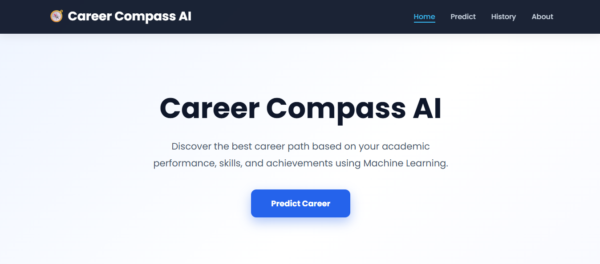
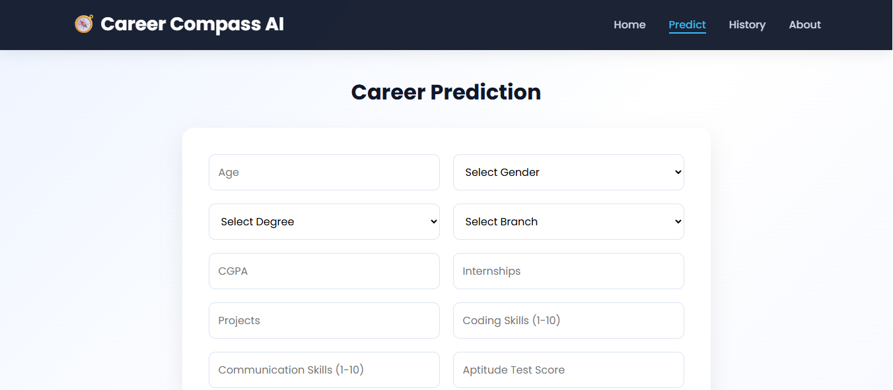
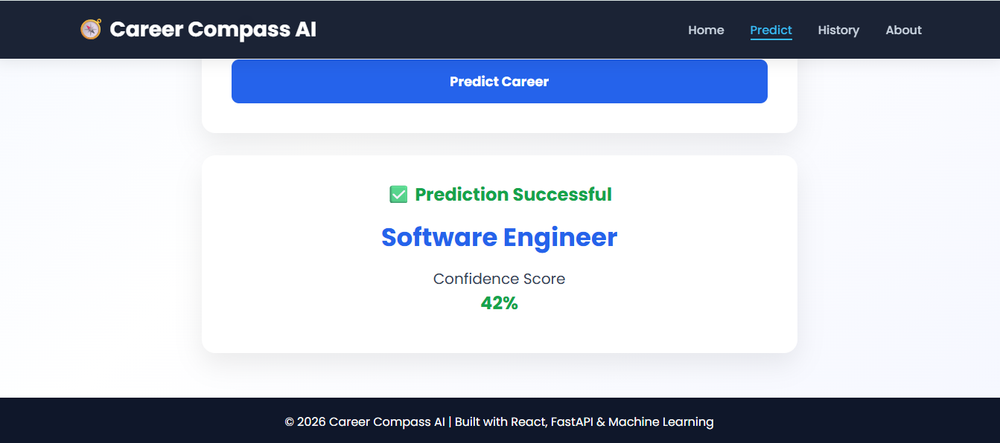
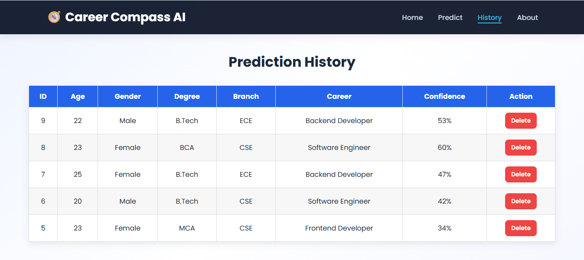
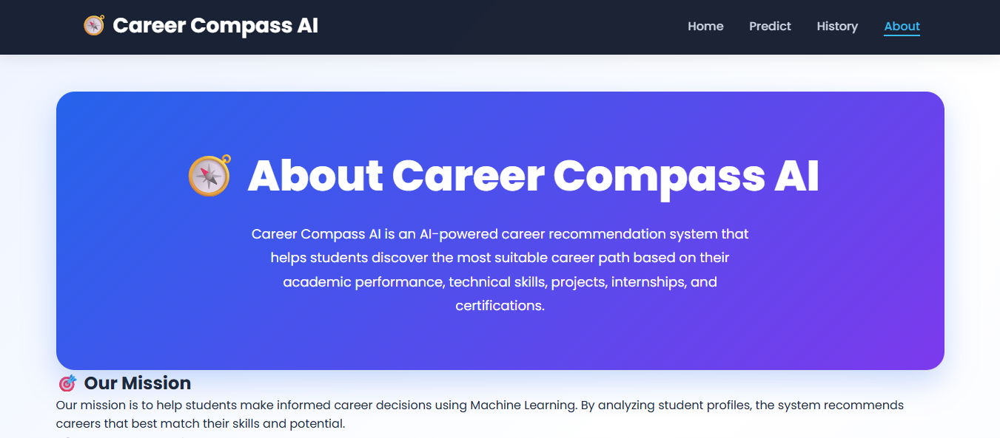

# 🎯 Career Compass AI

An AI-powered Career Recommendation System that predicts the most suitable career path for students based on their academic profile and skills. The project is built using Machine Learning, FastAPI, React, and MySQL, and is fully deployed on the cloud.

---

## 🚀 Live Demo

### 🌐 Frontend
https://career-compass-ai-beta.vercel.app

### ⚙️ Backend API
https://career-compass-ai-ktqf.onrender.com

### 💻 GitHub Repository
https://github.com/suraj-tiwary18/Career-Compass-AI

---

# 📌 Features

- 🤖 AI-based Career Prediction
- 📊 Machine Learning Model
- ⚡ FastAPI Backend
- 🎨 React + Vite Frontend
- 🗄️ MySQL Database
- ☁️ Railway Cloud Database
- 📜 Prediction History
- 🗑️ Delete Individual History Records
- 📱 Responsive UI
- 🐳 Docker Containerization
- 🌍 Cloud Deployment

---

# 🛠️ Tech Stack

## Frontend
- React
- Vite
- Axios
- CSS

## Backend
- FastAPI
- Python
- Uvicorn
- Pydantic

## Machine Learning
- Scikit-learn
- Pandas
- NumPy
- Joblib

## Database
- MySQL
- Railway MySQL

## Deployment
- Vercel
- Render
- Railway

## Containerization
- Docker
- Docker Compose

---

# 📂 Project Structure

```text
Career Compass AI
│
├── backend/
│   ├── app/
│   ├── requirements.txt
│   ├── Dockerfile
│   └── .env
│
├── frontend/
│   ├── src/
│   ├── public/
│   ├── Dockerfile
│   └── package.json
│
├── artifacts/
│   ├── career_model.pkl
│   └── scaler.pkl
│
├── dataset/
│
├── docker-compose.yml
├── README.md
└── requirements.txt
```

---

# ⚙️ Installation

## Clone Repository

```bash
git clone https://github.com/suraj-tiwary18/Career-Compass-AI.git

cd Career-Compass-AI
```

---

# Backend Setup

```bash
cd backend

python -m venv venv

venv\Scripts\activate

pip install -r requirements.txt

uvicorn app.main:app --reload
```

Backend runs on:

```
http://127.0.0.1:8000
```

---

# Frontend Setup

```bash
cd frontend

npm install

npm run dev
```

Frontend runs on:

```
http://localhost:5173
```

---

# 🐳 Docker Setup

Build and run the application using Docker Compose.

```bash
docker compose up --build
```

Stop containers:

```bash
docker compose down
```

---

# 🌐 Deployment

## Frontend

- Vercel

## Backend

- Render

## Database

- Railway MySQL

---

## 📸 Screenshots

### 🏠 Home Page



### 🎯 Prediction Page



### 🤖 Prediction Result



### 📜 History Page



### ℹ️ About Page



---

# 📊 Machine Learning Workflow

Dataset

↓

Data Preprocessing

↓

Feature Engineering

↓

Model Training

↓

Model Evaluation

↓

Model Serialization (Joblib)

↓

FastAPI Backend

↓

React Frontend

↓

Prediction

↓

Store Prediction History

---

# 📈 Future Enhancements

- User Authentication
- Career Roadmap Recommendation
- Resume Analysis
- Skill Gap Detection
- Course Recommendation
- Dashboard Analytics
- Email Report Generation

---

# 👨‍💻 Author

**Suraj Kumar Tiwari**

B.Tech Computer Science Engineering

Arya College of Engineering, Jaipur

GitHub:
- GitHub: https://github.com/suraj-tiwary18

LinkedIn:
- LinkedIn: https://www.linkedin.com/in/suraj-tiwari-580984332/

---

# ⭐ Support

If you found this project useful, please consider giving it a ⭐ on GitHub.
